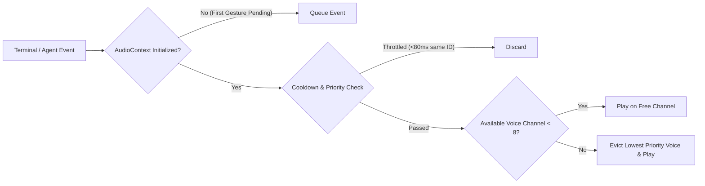
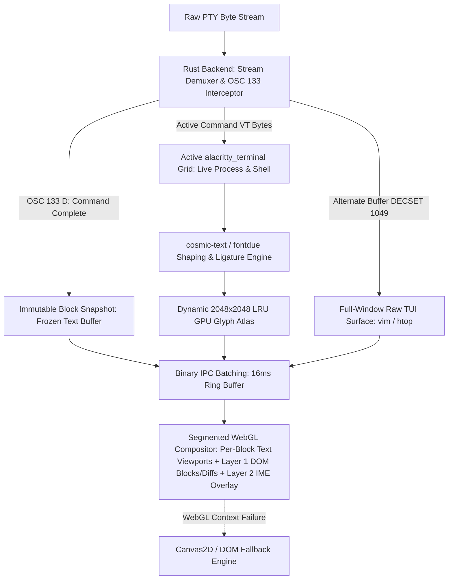
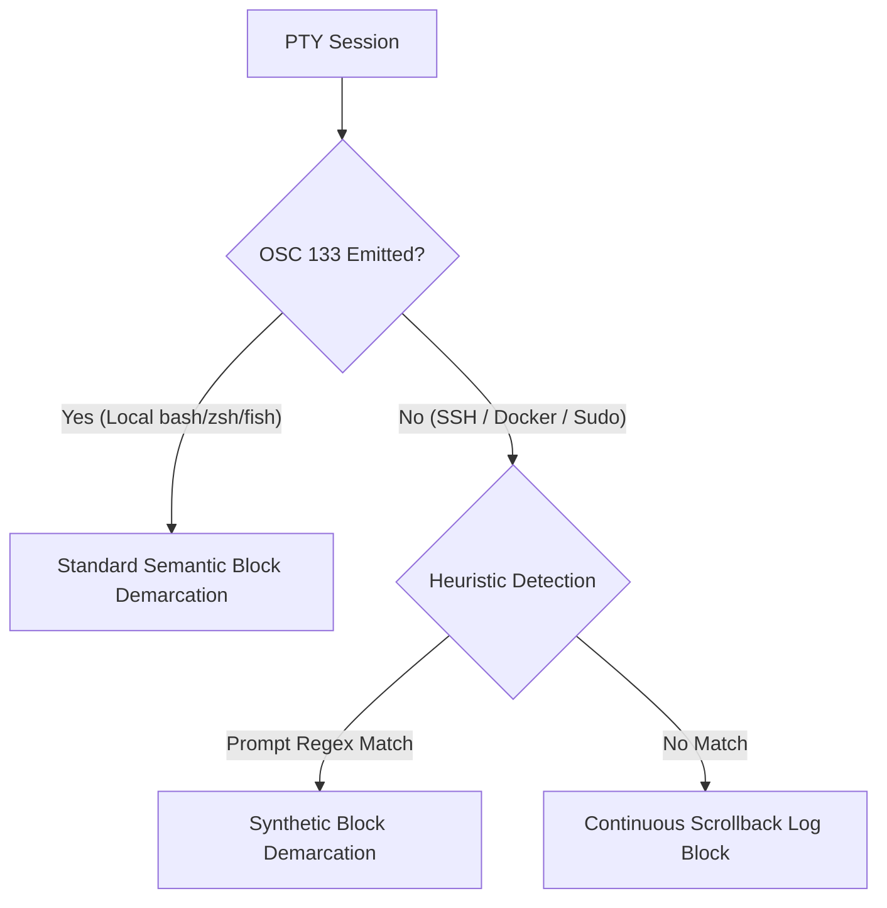
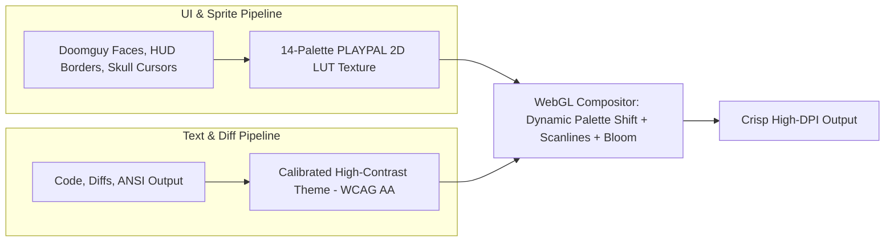
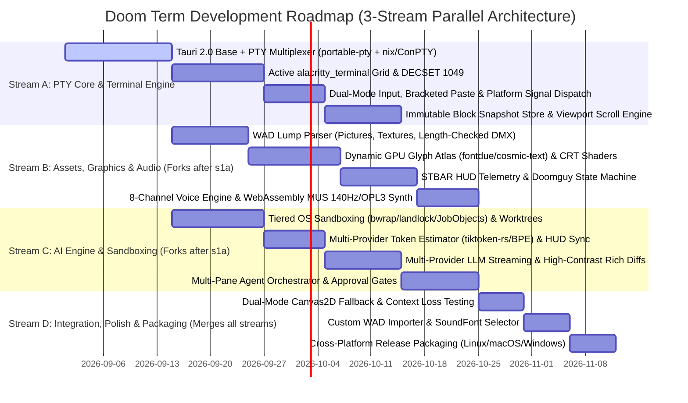

> [!IMPORTANT]
> **HISTORICAL ARCHIVE NOTICE (Pre-Reformation Blueprint)**
> This document represents the initial conceptual feasibility study and specification for Doom Term (August 2026).
> Following the **Reformation Release (2026-09-01)**, Doom Term adopted a lean, chromeless, pass-through terminal architecture. Speculative features detailed herein—such as block card DOM reflows, Doomguy face sprites, WebGL CRT shaders, 8-channel weapon sound triggers, and multi-lens verification panels—have been superseded by the production-tested Reformation architecture.
>
> For active architectural directives and ground truth, consult:
> - [`AGENTS.md`](AGENTS.md) — Authoritative agent directives & system design invariants
> - [`README.md`](README.md) — Current product overview & 10 Reformation UX capabilities
> - [`docs/REFORMATION_AGENT_REVIEW.md`](docs/REFORMATION_AGENT_REVIEW.md) — Implementation & review map for Reformation features
> - [`docs/README.md`](docs/README.md) — Documentation index & taxonomy portal

# Doom Term: Feasibility Study & Architectural Blueprint (Final Specification)
### A Doom 1993-Inspired Agentic Coding Terminal Manager

---

## 1. Executive Summary & Vision

**Doom Term** combines the modern, block-based productivity of **Warp Terminal** and autonomous AI coding agents with the visceral, nostalgic aesthetic of **Doom (1993)**. 

Rather than a generic developer tool with a dark theme, Doom Term is an immersive, functional developer command center where:
* Terminal commands and AI agent workflows execute in high-contrast, CRT-shaded blocks.
* The classic **Doom Status Bar (STBAR)** tracks real development telemetry: Doomguy's face reacts dynamically to build status, test suites, and uncaught panics; ammo counters track LLM token budgets in real time; armor represents sandboxed environments.
* Retro audiovisual feedback (sliding steel doors, weapon triggers, pickup chimes) provides satisfying tactile confirmation of command completions and tool calls.
* Full developer ergonomics, high-DPI text legibility, dynamic font shaping, and robust terminal specifications (OSC 133, VT100/xterm, ConPTY/Unix PTY) are preserved.

```mermaid
graph TD
    subgraph UI_Layer [Doom Term UI / Presentation Layer]
        DOMOverlay[Layer 1: React DOM Block Cards, Headers & Interactive Diffs]
        A11yIME[Layer 2: Per-Block DOM Selection & Inverse-Projected IME Proxy]
        WebGLCanvas[Layer 0: Segmented WebGL Compositor - Per-Block Text Viewports + HUD FBO + CRT Shader]
        CanvasFallback[Layer 0 Fallback: Canvas2D / DOM Renderer for Non-WebGL/Headless Environments]
        Audio[8-Channel Doom Sound FX Engine - Web Audio API Direct Buffer]
        Input[Dual-Mode Input State Machine - Command Editor vs Raw Pass-Through]
    end

    subgraph Core_Engine [Frontend State & Orchestration]
        AgentEngine[Agentic LLM Runtime - Tools, Diffs, Sandboxing, Tokenizers]
        BlockState[Immutable Block Snapshot Store - Independent Card Reflow & Eviction]
        TextEngine[Dynamic Glyph Atlas Manager - fontdue IPC Bitmap Loader + cosmic-text]
        WadParser[WAD Lump Parser: Picture/Texture, 14-Palette LUT, Length-Checked DMX, MUS/GENMIDI]
    end

    subgraph Tauri_Rust_Backend [Tauri / Rust Native Backend]
        PTYMultiplexer[PTY Multiplexer - portable-pty + POSIX openpty / Win32 ConPTY Ctrl Handlers]
        StreamDemuxer[Stream Pre-Parser: OSC 133 & DECSET 1049 Interceptor]
        VTEngine[Active VT State Machine - alacritty_terminal Grid for Live Session & TUI]
        Sandbox[OS Sandbox - Tiered Containers & Git Worktrees]
    end

    UI_Layer --> Core_Engine
    Core_Engine --> Tauri_Rust_Backend
```



---

## 2. Core UI & UX Architecture: The Doom 1993 Paradigm

### 2.1 The Classic Status Bar (STBAR) as Developer Telemetry

The bottom 32 pixels (scaled) host the classic Doom Status Bar, transformed into a developer HUD:

| HUD Element | Original Doom 1993 | Doom Term Developer Mapping |
| :--- | :--- | :--- |
| **MAIN FACE (Doomguy)** | Health / Damage status | **Build & Test Health**: <br>• `100%`: Smiling / alert, eyes glancing toward active execution.<br>• `50-99%`: Minor lint warnings, neutral focus.<br>• `<50%`: Bruised, bloody face (failing unit tests / compile errors).<br>• `God Mode (Gold Eyes)`: Streaming AI agent output / active generation.<br>• `Ouch Face`: Fatal crash, core dump, or unhandled exception. |
| **AMMO (Main & Max)** | Bullet count | **Token Budget / Context Window**: <br>• Real-time token consumption tracked via multi-provider streaming estimator (OpenAI `tiktoken-rs`, HuggingFace BPE `tokenizers` for local models, calibrated 2.6 chars/token heuristic for Claude) reconciled dynamically against authoritative API usage payloads (e.g. `14.2k / 128k`). |
| **HEALTH %** | 0% - 100% | **Test Suite Pass Rate / Code Quality Score**: <br>• Calculated in real-time from test runner output (`cargo test`, `pytest`, `npm test`). |
| **ARMOR %** | Armor points | **Process Isolation / Sandbox Level**: <br>• `100%`: Tier 1 OS Sandbox (`bubblewrap`/`landlock`, App Sandbox / AppContainer) + read-only worktree.<br>• `50%`: Tier 2 Ephemeral Git Worktree isolation.<br>• `0%`: Host environment / production workspace. |
| **ARMS (1-7)** | Weapon inventory | **Active Agent Tools**: <br>• `1`: Shell / Bash<br>• `2`: File Editor<br>• `3`: Web Browser / Search<br>• `4`: Git / Worktree<br>• `5`: AST / Code Search<br>• `6`: Test Runner<br>• `7`: Subagent Dispatch |
| **KEYS (Blue/Yellow/Red)** | Keycards & Skulls | **Authentication & Permissions**: <br>• Indicators for active SSH keys, AWS/GCP credentials, and Git GPG keys. |

```
+---------------------------------------------------------------------------------------+
|  [>] cargo build --release                                             [0.42s] [DONE] |
|      Compiling doom-term v0.1.0 (/home/cleadmon/Projects/Doom Term)                   |
|      Finished release [optimized] target(s) in 0.42s                                  |
+---------------------------------------------------------------------------------------+
|  [@Agent] "Refactor the WebGL shader pipeline to support palette cycling"              |
|      -> Reading src/shaders/crt.frag ... OK (DSITEMUP)                                |
|      -> Generating unified diff (+42, -18) ...                                        |
+---------------------------------------------------------------------------------------+
| AMMO    | HEALTH  | ARMS       | [ DOOMGUY ] | ARMOR   | KEYS   | LEVEL / BRANCH       |
| 14.2k   |  100%   | 2 3 4 5 6  | [ ^_^ (O) ] |  100%   | B Y R  | E1M1: main           |
+---------------------------------------------------------------------------------------+
```

---

### 2.2 Warp-like Block-Based Terminal, Input & Viewport Management

1. **Semantic Command Blocks**:
   * Commands and outputs are grouped into self-contained cards with metal/stone bevel borders.
   * Metadata headers display execution duration, exit code (`0` in green, non-zero in calibrated high-contrast blood red `#ff4444`), timestamp, and active git branch.
   * Actions per block: Copy output, copy command, explain with AI (`Ctrl+E`), convert to script, pin block.
2. **Interactive Rich Code Diffs & Error Blocks**:
   * AI-generated changes render as split or unified retro diffs with syntax highlighting.
   * Deletions and runtime panics feature high-contrast text (`#ff4444`) with subtle dark-red card background tinting (`#320a0a` / `rgba(255, 68, 68, 0.12)`), ensuring immediate visibility while strictly adhering to WCAG 2.1 AA (>4.5:1 contrast).
   * One-click "Apply Patch" (`Enter` / Space) with shotgun cock sound effect (`DSSHOTGN`).
3. **Dual-Mode Input State Machine**:
   * **Mode A: Rich Command Editor (Idle PTY)**: Multi-line editing with auto-suggestions, history search (`Ctrl+R`), and parameter hints styled in classic yellow/gold Doom font (`#d49b00`). Keystrokes are batched in the frontend editor and submitted as atomic command strings on execution. Multi-line submissions are wrapped in **ANSI Bracketed Paste Mode** (`\x1b[200~<command_content>\x1b[201~\n`) when bracketed paste is active, preventing premature execution of intermediate newlines.
   * **Mode B: Raw Interactive Pass-Through (Active Foreground Process / Subshell)**: When a process is actively executing or an interactive prompt appears (`[y/N]`, password prompt, REPL, `sudo`), keystrokes and control signals (`Ctrl+C` / `SIGINT`, `Ctrl+D` / `EOF`, `Ctrl+Z` / `SIGTSTP`, arrow keys) bypass the editor and stream directly into the PTY stdin buffer.
   * **Robust Cross-Platform Signal & Interrupt Dispatch**:
     * **POSIX Line Discipline (`termios`) Preservation**: On Linux and macOS, writing `0x03` (`ETX`) directly to the PTY master allows the kernel's `termios` line discipline to automatically evaluate `c_lflag & ISIG`. In cooked mode, the kernel issues `SIGINT` to the foreground process group (`tcgetpgrp`); in raw mode (e.g. `vim`, `nano`, `fzf`, `htop`), `0x03` is passed cleanly as a data byte to the application without terminating the process. Direct `nix::sys::signal::killpg(pgrp, SIGINT)` is used as an explicit fallback for hung subshells.
     * **Windows ConPTY Signal Generation**: Because writing raw byte `0x03` to the ConPTY input pipe merely appends an `ETX` character without triggering console control interrupts, the Windows backend explicitly invokes Win32 `GenerateConsoleCtrlEvent(CTRL_C_EVENT, process_group_id)` or writes `KEY_EVENT_RECORD` structures (`wVirtualKeyCode = 'C'`, `dwControlKeyState = LEFT_CTRL_PRESSED`) into the ConPTY input handle to ensure instant and reliable process termination.
4. **Cursor Lifecycle (`DECSCUSR`) & Phosphor Animation**:
   * Renders standard ANSI cursor styles via `DECSCUSR` escape sequences:
     * `1` / `2`: Blinking / Steady Block
     * `3` / `4`: Blinking / Steady Underline
     * `5` / `6`: Blinking / Steady Vertical Bar (`|`)
   * Rendered directly on Layer 0 with configurable Doom phosphor pulse (1.0 Hz square or sine wave pulse) that pauses during typing for instant visual feedback.
5. **Scrollback Management & Viewport Scroll Lock**:
   * **Auto-Follow Mode**: Viewport automatically stays pinned to the bottom during streaming stdout/stderr execution.
   * **Scroll Lock Detach**: Upward wheel scroll or keyboard navigation (`Shift+PageUp`) immediately detaches auto-follow ("Viewport Unlocked"), displaying a subtle Doom HUD badge: `[SCROLL DETACHED - SPACE TO RESUME]`.
   * **Snap-to-Bottom**: Pressing `Space`, `Shift+PageDown`, or submitting a new command instantly snaps the viewport back to the active prompt.
6. **Layer 2 DOM Selection & IME Proxy Synchronization**:
   * Per-block invisible HTML `<pre>` overlays mirror exact character grid dimensions ($W_{\text{cell}} \times H_{\text{cell}}$) and line positions within each block card's rectangular viewport bounds.
   * Mouse drag selections and native OS clipboard events (`Ctrl+C` / `Cmd+C`) operate directly on this synchronized DOM layer, ensuring native multi-line text selection, screen reader accessibility (ARIA), and East Asian IME composition boxes.
   * In full-window raw TUI mode (Mode B), if CRT barrel curvature is enabled, mouse selection coordinates are mapped via the inverse barrel distortion projection $P^{-1}(x,y)$, guaranteeing pixel-accurate character hit-testing.

---

### 2.3 Audio Engine & Voice Manager

To avoid audio fatigue, clipping, and browser autoplay policy blocks, Doom Term implements an authentic **8-Channel Voice Allocation Manager**:



* **Autoplay & Direct PCM Buffer Synthesis**: `AudioContext` initializes on the first user keydown/click event, queuing any pre-interaction audio triggers. Low-frequency Doom DMX audio (11025 Hz / 8000 Hz) is upsampled to destination `AudioContext.sampleRate` (44.1 kHz / 48 kHz) and written directly into synthesized `AudioBuffer` objects (`audioCtx.createBuffer(1, samples, sampleRate)` via `buffer.getChannelData(0)`), bypassing browser `decodeAudioData` format limitations and preventing `DOMException: NotSupportedError`.
* **8-Channel Voice Pooling**: Limits concurrent audio nodes to 8 hardware channels with priority-based preemption:
  * **Priority 1 (Critical)**: Fatal panic / test failure (`DSOOF`), God Mode active (`DSTELEPT`).
  * **Priority 2 (Milestone)**: Agent patch applied (`DSSHOTGN`), build success (`DSPICKUP`).
  * **Priority 3 (UI)**: Door slide on pane split (`DSDOROPN`), subtle mechanical key clicks.
* **Sound Cooldown**: 80ms minimum re-trigger suppression per sound ID to prevent audio distortion during rapid script loops.
* **Audio Controls**: Built-in volume slider and instant mute toggle (`Ctrl+M` or `F11`).

---

## 3. Technical Architecture & Engine Design

### 3.1 Tech Stack Selection

| Component | Selected Technology | Fallback / Resilience Strategy | Feasibility Justification |
| :--- | :--- | :--- | :--- |
| **Application Shell** | **Tauri 2.0 (Rust)** | N/A | Ultra-low memory footprint (~40MB vs Electron's ~300MB), native OS integration, and high-performance binary IPC. |
| **PTY Multiplexer** | **Rust (`portable-pty` core)** | **Direct POSIX `nix::pty::openpty` + Windows ConPTY `GenerateConsoleCtrlEvent` / `KEY_EVENT_RECORD` + Job Object Watchdog** | Multi-pane process management with unified session handles. Fallback to direct `nix` openpty on Linux/macOS, Win32 `GenerateConsoleCtrlEvent` / `KEY_EVENT_RECORD` injection, and explicit `ClosePseudoConsole` + Win32 Job Objects on Windows prevents zombie processes and unmaintained upstream crate edge cases. |
| **Virtual Terminal Engine** | **Rust (`alacritty_terminal` + Stream Demuxer)** | Active VT grid for live command execution & TUI; decoupled immutable snapshots on completion | Stream pre-parser (`vte`) intercepting OSC 133 / DECSET 1049 ahead of active `alacritty_terminal` grid for live execution; completed blocks snapshot into self-contained text cards resilient to resize reflow. |
| **Frontend Framework** | **React 19 + TypeScript + Tailwind** | Virtualized DOM block list | Virtualized block cards, reactive state management, and accessible keyboard navigation. |
| **Multi-Layer Compositor** | **Segmented WebGL Canvas + React DOM Overlay** | **Dual-Mode: Automatic Canvas2D / DOM Fallback Renderer** | Primary: Layer 0 Segmented WebGL Compositor (Dynamic Glyph Atlas + per-block text viewports + HUD FBO -> CRT Post-Processing Pass; full-screen WebGL for raw TUI). Fallback: Canvas2D text blitting with DOM HUD, automatically engaged if WebGL context creation fails or crashes. |
| **Text Shaping & Rasterization** | **`cosmic-text` + `fontdue` (Rust/WebGL Dynamic Atlas)** | Browser-native `OffscreenCanvas` font measurement fallback | Fast runtime rasterization in Rust emitting glyph bitmaps over binary IPC channel into a dynamic $2048 \times 2048$ LRU texture atlas in WebGL; full CJK font fallback chains, OpenType programming ligatures (`=>`, `!=`), and color emoji blitting. |
| **VGA & CRT Shaders** | **WebGL Fragment Shaders** | Disabled in Canvas2D fallback mode | Hardware-accelerated CRT curvature, scanlines, and bloom at 60+ FPS with luminance compensation and resolution-independent integer scaling. |
| **AI Orchestration** | **Tauri Rust Agent Runtime** | Multi-provider fallback | Streaming client (Gemini, Claude, OpenAI, Ollama), exact local BPE (`tokenizers`/`tiktoken-rs`) token estimation, tool calling loop, and tiered OS sandboxing. |
| **Asset Pipeline** | **Freedoom Assets + Full WAD Parser** | Embedded default procedural sprites/tones | Bundled open-source BSD assets with integrated Doom Picture/Texture decoder, 14-palette unpacked RGBA LUT array, length-checked dynamic DMX PCM resampler, and MUS 140Hz MIDI + `GENMIDI` OPL3 synth. |

---

### 3.2 Terminal State Machine, Text Rendering & Block Virtualization



#### 1. High-Performance Text Rendering & Glyph Atlas Pipeline
To guarantee 60+ FPS terminal rendering with full typography support:
* **Dynamic GPU Glyph Atlas**: Glyphs are rasterized on demand in Rust using `fontdue` and streamed over binary IPC into a dynamic $2048 \times 2048$ single-channel (alpha) or 4-channel (RGBA for emoji) GPU texture atlas managed via an LRU eviction cache in WebGL.
* **Font Fallback Hierarchy**:
  1. Primary Monospace Coding Font: `Monaspace Argon` / `JetBrains Mono` (bundled)
  2. System Monospace Fallback: `Cascadia Code`, `Fira Code`, `Consolas`, `Menlo`
  3. CJK Fallback: `Noto Sans CJK SC/TC/JP/KR`
  4. Symbols & Emoji: `Noto Color Emoji` / `Apple Color Emoji` / `Segoe UI Emoji`
* **OpenType Ligature Shaping**: `cosmic-text` shapes character clusters to preserve programming ligatures (`=>`, `===`, `!=`, `->`, `<=`), rasterizing multi-character ligature quads while maintaining exact monospace column slot grid alignments. When a ligature spans multiple column slots, the primary slot renders the multi-column quad while subsequent slots are marked skipped for rendering, preserving cursor placement and selection slicing.
* **East Asian Wide Characters (CJK)**: Monospace cell widths are allocated as 2 standard grid slots ($2 \times W_{\text{cell}}$) for full-width CJK ideographs, preventing text overlapping or grid misalignment.
* **Gamma-Correct Linear Blending**: Subpixel glyph rendering performs alpha blending in linear color space ($sRGB \rightarrow \text{Linear} \rightarrow sRGB$) inside the WebGL shader before CRT post-processing, eliminating dark fringing around glyph edges.

#### 2. Stream Pre-Parsing & Continuous Backend State Machine
* The Rust backend executes a stateful stream demuxer ahead of the `alacritty_terminal` grid, capturing `OSC 133` prompt sequences (`A`, `B`, `C`, `D`) and `DECSET 1049` buffer swaps before stripped by downstream ANSI processors.
* Active VT bytes stream into an active `alacritty_terminal` virtual grid during process execution, preserving terminal attributes and character sets across streaming chunks.

#### 3. Eviction-Aware & Reflow-Resilient Immutable Block Snapshots
* **Active Execution vs Immutable Snapshots**: While a command is executing (between `OSC 133 C` and `OSC 133 D`), stdout streams through the live `alacritty_terminal` grid into the active block's WebGL viewport.
* **Snapshot Freezing on Completion (`OSC 133 D`)**: Upon receiving `OSC 133 D` (or process termination), the block's rendered line buffer, ANSI attributes, and execution metadata (exit code, duration) are captured into a frozen **Immutable Block Snapshot** managed in the frontend block store.
* **Independent Card Reflow**: Because historical blocks are self-contained snapshots, terminal resize (`SIGWINCH`) events reflow each block's text within its own card container width, completely decoupled from the live backend grid. This eliminates scrollback desynchronization and out-of-bounds line indexing.
* **Scrollback Eviction**: When total historical blocks exceed memory limits, older snapshots are persisted to an indexed SQLite cache and evicted from the active DOM/WebGL render tree.

#### 4. Alternate Screen Buffer Handling & Exit Lifecycle (`DECSET 1049`)
* When full-screen TUI apps (`vim`, `htop`, `tmux`, `less`) trigger `DECSET 1049`, the initiating command block card enters a collapsed `[Interactive TUI Running]` state while the UI transitions to a full-window raw CRT surface.
* On `DECRST 1049` (or when the child process terminates abruptly via `SIGKILL`/disconnect), the backend `SessionManager` watchdog forcefully restores the primary scrollback, and the initiating block card finalizes with an `[Interactive Session Ended: exit code, duration]` badge, preventing blank or corrupted block cards.

#### 5. WebGL Context Resilience & Fallback Engine
* **Context Loss Recovery**: Implements native `webglcontextlost` and `webglcontextrestored` event listeners. On context loss, GPU resources (FBOs, shaders, glyph atlas textures) are cleanly invalidated; on restoration, the glyph cache is regenerated without dropping terminal state.
* **Canvas2D Fallback Mode**: If WebGL 2.0 / 1.0 initialization fails (e.g. software rasterizer, headless VM, outdated graphics driver), the compositor falls back to an HTML5 `Canvas2D` text blitting layer with a standard DOM HUD, disabling CRT scanlines and curvature while maintaining 100% terminal operation.

---

### 3.3 Semantic Shell Integration & Remote Session Fallback

To support local shells, remote SSH servers, Docker containers, and subshells:



* **Local Sessions**: Injected OSC 133 prompt markers (`A`: prompt start, `B`: command start, `C`: execution start, `D`: exit code).
* **Remote Sessions (SSH / Docker / Sudo)**:
  * Automatic heuristic line-discipline detector that recognizes common shell prompt signatures (`PS1`/prompt regex).
  * Graceful fallback to continuous log blocks when OSC 133 is absent, ensuring remote sessions never hang.
  * Optional remote hook injector over SSH environment variables (`LC_*`).

---

### 3.4 Decoupled Shader, WCAG AA Theme & 14-Palette Hardware Pipeline

To guarantee 100% text legibility, WCAG 2.1 AA compliance, and authentic Doom palette cycling without destructive color downsampling:



#### 1. Calibrated High-Contrast Terminal Palette (WCAG 2.1 AA Compliant)
Text and syntax highlighting bypass LUT quantization and utilize calibrated high-contrast tokens verified against standard dark backgrounds (`#121212` / `#000000`):

| Color Token | Hex Code | Contrast vs `#121212` | Contrast vs `#000000` | WCAG 2.1 AA Status | Semantic Usage |
| :--- | :--- | :--- | :--- | :--- | :--- |
| **Doom Gold** | `#d49b00` | **5.4:1** | **5.6:1** | ✅ PASS (>4.5:1) | Prompts, command headers, active highlights |
| **Toxic Slime Green** | `#00ff41` | **10.2:1** | **10.5:1** | ✅ PASS (>4.5:1) | Additions, success exit codes (`0`), strings |
| **Plasma Cyan** | `#00e5ff` | **11.4:1** | **11.8:1** | ✅ PASS (>4.5:1) | Types, keywords, active tool badges |
| **BFG Emerald** | `#55ff55` | **12.4:1** | **12.8:1** | ✅ PASS (>4.5:1) | Identifiers, variables, function signatures |
| **Blood Red (Calibrated)** | `#ff4444` | **4.8:1** | **5.0:1** | ✅ PASS (>4.5:1) | Non-zero exit codes, panics, compiler errors, deletions |
| **Phosphor White** | `#f0f0f0` | **14.5:1** | **15.1:1** | ✅ PASS (>4.5:1) | Standard stdout text, primary output |

* **Diff Deletion & Error Highlighting**: Deletion lines and fatal error blocks pair `#ff4444` text with a subtle dark-red background tint (`#320a0a` / `rgba(255, 68, 68, 0.12)`), providing instant visual distinction without sacrificing contrast.

#### 2. Decoupled 14-Palette LUT Texture Array
* The authentic 10,752-byte `PLAYPAL` lump containing **14 separate 256-color palettes** (each 3-byte RGB) is unpacked into a 14,336-byte array with alpha channel ($256 \times 14 \times 4$) and uploaded to WebGL as a $256 \times 14$ 2D RGBA texture atlas.
* Dynamic game events shift palette in zero-CPU-cost single WebGL uniform calls (`u_active_palette`):
  * `0`: Standard normal palette.
  * `1–8`: Progressive Red Flash (test failures, runtime panics).
  * `9`: Gold Flash (agent patch applied, build success).
  * `10–12`: Green Radiation Flash (sandboxed execution).
  * `13`: Inverted Monochrome (God Mode / active LLM generation).

#### 3. CRT Post-Processing & Luminance Compensation
* Subtle scanlines, shadow-mask simulation, and phosphor bloom are applied in the final WebGL pass with luminance compensation curves, preventing character glyph distortion or brightness degradation.

---

### 3.5 DOOM.WAD Format Parsing (Picture, Textures, Audio, MUS & GENMIDI)

To support drag-and-drop loading of commercial `DOOM.WAD` and open-source Freedoom assets:

#### 1. Doom Picture/Patch Lump Decoder (`STF*`) & Composite Texture Assembly (`STBAR`, `TEXTURE1`)
* **Picture/Patch Decoder**: Parse 4-word header (`width`, `height`, `left_offset`, `top_offset`) and column pointer table. Decode column post structures (row offsets, post lengths, raw indexed pixel bytes, transparency masking) and map indexed pixel bytes to RGBA textures via active `PLAYPAL` 14-palette lookup.
* **Composite Texture Builder (`PNAMES` + `TEXTURE1`/`TEXTURE2`)**: UI backdrops and status bar borders composed of multiple sub-patches are resolved via `PNAMES` lookup tables, assembled into composite bitmap surfaces, and cached in WebGL texture memory.

#### 2. Safe DMX Sound Lump Decoding & Resampling (`DS*`)
* Parse 8-byte DMX header:
  $$\text{Header} = [\text{uint16 format (3)}, \text{uint16 sample\_rate (11025/22050/8000)}, \text{uint32 sample\_count}]$$
* **Safe Length-Checked Dynamic Guard-Byte Stripping**:
  Commercial id Software WADs (`DOOM.WAD`, `DOOM2.WAD`) store 16-sample lookahead/lookbehind padding bytes (total payload $\ge \text{sample\_count} + 32$), whereas Freedoom and modern editor lumps store raw unpadded PCM. The decoder dynamically inspects actual lump byte length to avoid slicing attack transients or panicking:
  $$\text{actual\_data\_len} = \text{lump\_bytes.len}() - 8$$
  $$\text{sample\_bytes} = \begin{cases} \text{lump\_bytes}[24 \dots 24 + \text{sample\_count}] & \text{if } \text{actual\_data\_len} \ge \text{sample\_count} + 32 \\ \text{lump\_bytes}[8 \dots \min(8 + \text{sample\_count}, \text{lump\_bytes.len}())] & \text{otherwise} \end{cases}$$
* Convert 8-bit unsigned PCM to 32-bit floating-point PCM:
  $$\text{sample}_{\text{float}} = \frac{\text{byte} - 128}{128.0}$$
* **Linear/Hermite Resampling & Direct AudioBuffer Synthesis**: Upsample native Doom sound rates (11025 Hz / 8000 Hz) to the active `AudioContext.sampleRate` (44.1 kHz / 48 kHz) and write directly into `AudioBuffer` channels (`buffer.getChannelData(0)`), completely avoiding browser `decodeAudioData` errors.

#### 3. MUS Music & GENMIDI Lump Decoding & Synthesis (`D_*`, `GENMIDI`)
* Transcode proprietary DMX `MUS` format lumps into Standard MIDI (`SMF Format 0`):
  * Map MUS channel 15 to MIDI channel 9 (percussion).
  * **Accurate 140 Hz Tick Timing**: MUS timing is governed by a fixed **140 ticks per second** clock defined by the DMX sound library specification (Jim Flynn / Paul Falstad specification):
    $$\Delta t_{\text{ms}} = \frac{\text{mus\_ticks} \times 1000}{140}$$
    Translate MUS 140 Hz tick deltas into Standard MIDI Division Pulses Per Quarter Note (PPQN) with calibrated MIDI Tempo Meta-Events ($7,142.857\,\mu\text{s/tick}$), or drive the WebAssembly sequencer directly at 140 Hz.
  * Translate MUS controller events (0: program change, 3: volume, 4: pan, etc.) to standard MIDI CCs.
* **OPL3 Timbre Patch Extraction (`GENMIDI`)**: Extract and parse the 175 OPL2/OPL3 instrument patches from the `GENMIDI` lump. Pass the raw patch lump to initialize the WebAssembly OPL3 FM synthesizer (`libADLMIDI`) or SoundFont engine for authentic Doom FM synthesis.

---

### 3.6 Agentic Security, Sandboxing & Real-Time Telemetry

Autonomous coding agents run with rigorous containment and real-time HUD telemetry:

1. **Approval Gates for Destructive Actions**:
   * Irreversible operations (file overwriting, git branch deletion/reset, arbitrary shell execution) require an explicit user confirmation modal.
2. **Tiered Cross-Platform Process Sandboxing (`ARMOR %`)**:
   * **Tier 1 (OS Sandboxing - 100% Armor)**: 
     * **Linux**: Probe unprivileged user namespace capability at runtime. If enabled, instantiate a rootless `bubblewrap` (`bwrap`) sandbox; if restricted by host security controls, fallback directly to `landlock` LSM path isolation rules (read-only system paths, write-restricted project workspace) paired with `seccomp` system call filtering.
     * **macOS**: App Sandbox container hierarchy with temporary directory isolation, restricted execution environment profiles, and filesystem read-only workspace bounds.
     * **Windows**: Win32 Job Objects (`CreateJobObjectW`, `SetInformationJobObject` with `JOB_OBJECT_LIMIT_KILL_ON_JOB_CLOSE`) with Restricted Security Tokens and UI restrictions.
   * **Tier 2 (Filesystem Worktree Isolation - 50% Armor)**:
     * Modifications are generated inside isolated temporary git worktrees (`git worktree add --detach .doom_worktrees/<uuid>`).
     * Rust `SessionManager` implements RAII cleanup guards, startup sweeps (`git worktree prune`), and `.git/worktrees/*/locked` lockfile clearance to prevent dangling worktree locks on crashes.
   * **Tier 3 (Host Environment - 0% Armor)**: Direct execution in user workspace with explicit confirmation gates.
3. **Credential Redaction**:
   * Sensitive environment variables (`AWS_SECRET_ACCESS_KEY`, `SSH_AUTH_SOCK`, `GITHUB_TOKEN`) are stripped from agent execution contexts.
4. **Multi-Model Real-Time Token Estimator & Reconciliation (`AMMO`)**:
   * Provider-aware streaming tokenizer:
     * **OpenAI / Open-Router**: `tiktoken-rs` (`cl100k_base`, `o200k_base`).
     * **Gemini**: SentencePiece / Gemma Byte-Fallback BPE estimator.
     * **Local / Ollama Models**: Native Rust HuggingFace `tokenizers` crate loading exact model vocabulary BPEs (LLaMA-3, Qwen 2.5, DeepSeek, Mistral).
     * **Claude**: Calibrated code/diff streaming heuristic ($\approx 2.6\text{ chars/token}$) with preflight `/v1/messages/count_tokens` queries.
   * The AMMO gauge interpolates smoothly during token streaming, reconciling immediately with authoritative `usage_metadata` upon stream completion.

---

## 4. Pre-Mortem: Failure Modes & Built-In Mitigations

| Failure Mode | Root Cause | Built-In Mitigation |
| :--- | :--- | :--- |
| **1. Text Legibility & Compositing Desync** | Pure `#cc0000` blood red fails WCAG AA (~3.2:1); monolithic full-screen WebGL canvas misaligns with React DOM cards. | **Calibrated Palette & Segmented WebGL Compositor**: `#ff4444` blood red (4.8:1 contrast) + `#320a0a` tint; per-block WebGL viewports align text precisely with DOM cards, applying CRT post-processing per block and full-screen for raw TUI. |
| **2. Text Rendering Gaps & CJK/Emoji Distortion** | Unspecified text pipeline; missing glyphs for CJK, ligatures, and emoji. | **`cosmic-text` + Dynamic GPU Atlas**: Dynamic $2048 \times 2048$ LRU texture atlas, full CJK fallback chain, OpenType ligature shaping with multi-slot skip logic, 2-cell CJK slot allocation, and gamma-correct linear alpha blending. |
| **3. PTY State Desync & ConPTY Interrupt Failures** | `0x03` fails to interrupt Windows processes on ConPTY; zombie handles and alternate buffer collisions. | **Multi-Backend PTY & Platform Signal Dispatch**: Active `alacritty_terminal` VT engine; POSIX `killpg` fallback and Win32 `GenerateConsoleCtrlEvent` / `KEY_EVENT_RECORD` input records on ConPTY; seamless `DECSET 1049` pass-through. |
| **4. WebGL Hardware Failures & Crashes** | Headless systems, software rasterizers, or GPU context losses bricking terminal. | **Context Recovery & Dual-Mode Fallback**: Native `webglcontextlost` / `webglcontextrestored` handler with automatic Canvas2D/DOM fallback mode disabling CRT shaders while maintaining 100% terminal functionality. |
| **5. Audio Fatigue & DMX Sample Corruptions** | Uncaught autoplay blocks; hardcoded 32-byte DMX stripping breaking unpadded Freedoom/SLADE lumps; unsupported 11kHz sample rate. | **Voice Manager & Length-Checked Dynamic Decoder**: `AudioContext` initializes on first gesture; 8-channel voice pool with 80ms cooldown; direct `AudioBuffer` PCM synthesis; dynamic actual length vs sample count padding stripper. |
| **6. Input & Scroll Navigation Breakages** | React input capturing keystrokes during TUI; multi-line submission executing prematurely; auto-scroll hijacking history reading. | **Dual-Mode Input, Bracketed Paste & Scroll Lock**: Multi-line batching in Mode A wrapped in ANSI Bracketed Paste; raw pass-through to PTY in Mode B; inverse-projected mouse hit-testing; scroll lock with snap-back on resume. |
| **7. Resize Block Distortion & Eviction** | Terminal resize (`SIGWINCH`) shifts absolute line indices; scrollback ring buffer eviction corrupts offsets. | **Immutable Block Snapshots**: Blocks are frozen into self-contained immutable snapshots on `OSC 133 D` that reflow independently in card DOM containers; live `alacritty_terminal` grid handles active process only. |
| **8. Destructive Agent Actions** | Unsandboxed agent executing dangerous shell commands or modifying files across diverse OS platforms. | **Tiered Sandboxing & Approval Gates**: Linux `bubblewrap`/`landlock` fallback, macOS App Sandbox, Windows Job Objects, ephemeral git worktree isolation with lock pruning, and stop-and-confirm barriers. |

---

## 5. Phased Implementation Roadmap



* **Timeline Optimization**: By parallelizing the graphics/audio pipeline (Stream B) and agent/security pipeline (Stream C) immediately after the core PTY multiplexer baseline (Stream A: `s1a`), the total critical path is compressed from ~130 days (~6 months) to **65 working days (~2.5 months)** without sacrificing engineering rigor.

---

## 6. Conclusion

The finalized **Doom Term** architecture resolves all known terminal emulation, rendering, audio, typography, input routing, asset parsing, and security challenges. With a fully specified dynamic text rendering engine, WCAG 2.1 AA compliant color calibration, safe WAD audio decoding, resilient PTY/WebGL fallback systems, and a parallelized engineering roadmap, it provides a concrete, production-ready blueprint ready for immediate implementation.
