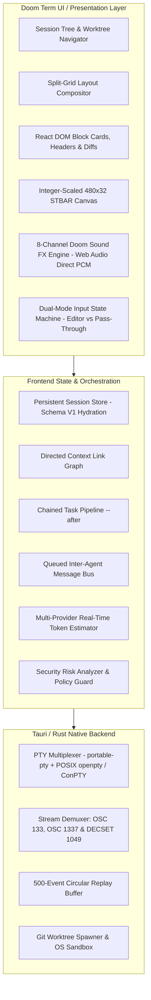

<div align="center">

```
______ _____ _____ ___  ___   _____ _____ _____ ___  ___
|  _  \  _  |  _  ||  \/  |  |_   _|  ___| ___ \|  \/  |
| | | | | | | | | || .  . |    | | | |__ | |_/ /| .  . |
| | | | | | | | | || |\/| |    | | |  __||    / | |\/| |
| |/ /\ \_/ /\ \_/ /| |  | |    | | | |___| |\ \ | |  | |
|___/  \___/  \___/ \_|  |_/    \_/ \____/\_| \_|\_|  |_/
```

### **A Doom (1993)-Inspired Agentic Coding Terminal Manager**
*Combining the visceral, nostalgic aesthetic of Doom 1993 with autonomous AI agent orchestration, spatial workspaces, and block-based terminal workflows.*

[](https://github.com/CMLeadmon/Doom-Term/actions/workflows/ci.yml)
[](https://opensource.org/licenses/MIT)
[](https://react.dev/)
[](https://www.rust-lang.org/)
[](https://tauri.app/)
[](https://vitejs.dev/)

---

[Features](#-key-features) • [20 Architectural Improvements](#-20-architectural-improvements) • [STBAR Telemetry](#-classic-status-bar-stbar-as-developer-telemetry) • [Quickstart](#-quickstart) • [Keybindings](#-keyboard-shortcuts) • [Architecture](#-system-architecture)

</div>

---

## ⚡ Vision & Philosophy

**Doom Term** merges the block-based productivity of modern terminals and autonomous AI coding agents with the tactile aesthetic of **Doom (1993)**.

Rather than a generic developer tool with a dark theme, Doom Term is an immersive, functional developer command center:
* **The Classic Doom Status Bar (STBAR)** tracks real developer telemetry: Doomguy's face reacts dynamically to build status, test suites, and uncaught panics; ammo counters track real-time LLM token budgets; armor represents sandboxed environments.
* **Hierarchical Workspace Tree & Spatial Split Grids**: Organize projects into Git worktrees, terminal stations, and agent review panes.
* **Autonomous Agent Pipelines**: Native hooks for Claude Code, Codex, and Gemini with nonced message passing, context-link DAGs, and multi-lens verification.
* **Retro Audiovisual Feedback**: Tactile confirmation of command completions, patch applications, and security gates using authentic 8-channel Web Audio PCM buffers.
* **Strict 1993 Material System**: Zero border radius, hard 1px bevels, and calibrated WCAG 2.1 AA contrast.

---

## 🎮 Classic Status Bar (STBAR) as Developer Telemetry

The bottom 32 pixels (scaled at integer ratios) host the classic Doom Status Bar, transformed into a developer HUD:

```
+---------------------------------------------------------------------------------------+
|  [>] cargo build --release                                             [0.42s] [DONE] |
|      Compiling doom-term v0.2.0 (/home/cleadmon/Projects/Doom Term)                   |
|      Finished release [optimized] target(s) in 0.42s                                  |
+---------------------------------------------------------------------------------------+
|  [@Agent] "Refactor the WebGL shader pipeline to support palette cycling"              |
|      -> Reading src/shaders/crt.frag ... OK                                           |
|      -> Generating unified diff (+42, -18) ...                                        |
+---------------------------------------------------------------------------------------+
| AMMO    | HEALTH  | ARMS       | [ DOOMGUY ] | ARMOR   | KEYS   | LEVEL / BRANCH       |
| 14.2k   |  100%   | 2 3 4 5 6  | [ ^_^ (O) ] |  100%   | B Y R  | E1M1: main           |
+---------------------------------------------------------------------------------------+
```

| HUD Element | Original Doom 1993 | Doom Term Developer Mapping |
| :--- | :--- | :--- |
| **MAIN FACE (Doomguy)** | Health / Damage Status | **Build & Test Health**:<br>• `100%`: Smiling / alert, eyes glancing toward active execution.<br>• `God Mode (Gold Eyes)`: Streaming AI agent output / active generation.<br>• `<50%`: Bruised face (failing unit tests / compile errors).<br>• `Ouch Face`: Fatal crash, core dump, or unhandled exception. |
| **AMMO (Main & Max)** | Bullet Count | **Token Budget / Context Window**:<br>• Real-time token consumption tracked via multi-provider streaming estimator reconciled dynamically against authoritative API usage payloads (e.g. `14.2k / 128k`). |
| **HEALTH %** | 0% – 100% | **Test Suite Pass Rate / Code Quality Score**:<br>• Calculated in real-time from test runner output (`cargo test`, `pytest`, `npm test`). |
| **ARMOR %** | Armor Points | **Process Isolation / Sandbox Level**:<br>• `FULL`: Tier 1 OS Sandbox (`bubblewrap`/`landlock`, AppContainer).<br>• `TREE`: Ephemeral Git Worktree isolation.<br>• `OFF`: Host environment / production workspace. |
| **ARMS (1–7)** | Weapon Inventory | **Active Agent Tools**:<br>`1`: Shell • `2`: File Editor • `3`: Web Browser • `4`: Git Worktree • `5`: Code Search • `6`: Test Runner • `7`: Subagent Dispatch |
| **KEYS (Blue/Yellow/Red)** | Keycards & Skulls | **Authentication & Permissions**:<br>• Indicators for active SSH keys (`B`), Cloud credentials (`Y`), and Git GPG signing keys (`R`). |

---

## 🏛️ 20 Architectural Improvements

Synthesized from **[nodeterm](https://github.com/eneskirca/nodeterm)** and **[VelaTerm](https://github.com/vlinx-io/VelaTerm)**:

```mermaid
graph TD
    subgraph Core_Tree_Persistence [1. Tree, Persistence & Layout]
        A1[1. Hierarchical Project/Group/Session Tree]
        A2[2. Persistent Ring-Buffer PTY Daemon]
        A3[3. Git Worktree Isolation & Binding]
        A4[4. Multi-Pane Spatial Split-Grid Layout Engine]
    end

    subgraph Agentic_Lifecycle_Graph [2. Agentic Lifecycle & Context Graph]
        B5[5. Structured Agent Lifecycle Hook Demuxer]
        B6[6. Inter-Node Context-Linking Engine]
        B7[7. Chained Execution Pipeline --after]
        B8[8. Queued Nonce-Verified Inter-Agent Bus]
        B9[9. Multi-Lens Verification Panel]
        B10[10. Live Markdown Scratchpad Cards]
    end

    subgraph Terminal_PTY_Core [3. PTY Engine & Rendering Robustness]
        C11[11. Cross-Platform Process Group Signal Router]
        C12[12. Immutable Block Snapshot & Eviction Store]
        C13[13. Bracketed Paste & Atomic Editor Mode]
        C14[14. Dual-Mode WebGL / Canvas2D Fallback]
        C15[15. Smart Scroll Lock & Detached Follow]
    end

    subgraph Security_Ergonomics_Remote [4. Security, Telemetry & Gateway]
        D16[16. Granular Security Risk & Policy Guard]
        D17[17. Multi-Provider Real-Time Token Meter]
        D18[18. Universal Fuzzy Command Palette Ctrl+P]
        D19[19. Encrypted Remote WebSocket Auth Gateway]
        D20[20. Zero-Downtime Local Persistence Engine]
    end

    Core_Tree_Persistence --> Agentic_Lifecycle_Graph
    Agentic_Lifecycle_Graph --> Terminal_PTY_Core
    Terminal_PTY_Core --> Security_Ergonomics_Remote
```



### 1. Hierarchical Project / Group / Session Tree Model
* 3-tier tree (`ProjectWorkspace` ➔ `SessionGroup` ➔ `SessionNode`) for organizing multiple parallel AI coding and terminal sessions.

### 2. Persistent Ring-Buffer PTY Session Daemon
* Rust backend keeps a 500-event circular replay buffer per session. Browser refreshes and tab switches reconnect seamlessly with zero lost output.

### 3. Git Worktree Isolation & Binding
* Automated provisioning of Git worktrees (`.worktrees/<branch>`) bound to session groups to eliminate write collisions between concurrent agents.

### 4. Multi-Pane Spatial Split-Grid Layout Engine
* Dynamic grid layouts: Single, Split Vertical (`1x2`), Split Horizontal (`2x1`), and Quad Grid (`2x2`) with synchronized focus and navigation.

### 5. Structured Agent Lifecycle Hook Demuxer
* ANSI OSC 1337 (`AgentState=...`) pre-parsing directly in Rust, driving Doomguy's face state (God Mode, Blue Eyes, Oof).

### 6. Inter-Node Context-Linking Engine
* Directed context graph allowing agents to inspect linked peers' transcripts, summaries, and terminal buffers on demand.

### 7. Dependent Task Pipeline (`--after`)
* Sessions can be spawned in an `ARMED` state, waiting until upstream tasks finish with exit code `0` before triggering execution.

### 8. Queued Nonce-Verified Inter-Agent Message Bus
* Delivers inter-agent messages (`--- NODETERM MESSAGE <nonce> ---`) cleanly when the target goes `idle`, protected by a 10s rate limiter.

### 9. Multi-Lens Verification Panel
* Parallel review stations (Correctness, Security, Performance, Tests) inspecting target diffs read-only before patch application.

### 10. Live Markdown Scratchpad & Sticky Notes
* Persistent markdown note nodes for architectural decisions, task boards, and agent memory.

### 11. Cross-Platform Process Group Signal Router
* Direct `killpg` signal dispatching (`Ctrl+C`, `Ctrl+Z`, `Ctrl+D`) to safely cancel foreground sub-processes without killing the host shell.

### 12. Immutable Block Snapshot & Eviction Store
* Completed command blocks freeze into immutable cards with pre-computed line indices and LRU DOM eviction.

### 13. Bracketed Paste & Atomic Editor Mode
* Multi-line input editor with bracketed paste mode (`\x1b[200~...\x1b[201~`), switching to raw pass-through during interactive child prompts (`sudo`, `[y/N]`, `fzf`).

### 14. Dual-Mode WebGL / Canvas2D Fallback
* High-reliability rendering with automatic fallback if WebGL contexts crash or are unavailable in headless environments.

### 15. Smart Scroll Lock & Detached Viewport Follow
* Auto-follow stream locked to bottom; user scrolling detaches follow with an interactive `[SCROLL DETACHED — PRESS SPACE TO RESUME]` Doom badge.

### 16. Granular Security Risk & Policy Guard
* AST and regex analysis for destructive commands (`rm -rf`, force push, database drops) with 3-tier action gating (`Run Once`, `Always Allow`, `Deny`).

### 17. Multi-Provider Real-Time Token Meter
* Live token accounting across Anthropic, OpenAI, Gemini, and local Ollama models.

### 18. Universal Fuzzy Command Palette (`Ctrl+P` / `Ctrl+K`)
* Fast fuzzy search across all sessions, worktrees, git actions, verification panels, layouts, and sound controls.

### 19. Encrypted Remote WebSocket Auth Gateway
* Bearer token authentication (`DOOM_AUTH_TOKEN`) for headless and remote server deployments.

### 20. Zero-Downtime Local Persistence Engine
* Automatic debounced synchronization of workspaces, active trees, scratchpads, and block histories to storage with auto-hydration on reload.

---

## 🚀 Quickstart

### Prerequisites
* **Node.js**: `v20.x` or `v22.x`
* **Rust**: `1.80+` (for backend PTY daemon & Tauri shell)
* **Git**: `2.30+`

### 1. Clone & Install Dependencies
```bash
git clone https://github.com/CMLeadmon/Doom-Term.git
cd Doom-Term
npm install
```

### 2. Start the Development Stack
```bash
# Terminal 1: Start the Rust PTY WebSocket Server (Port 1421)
npm run server

# Terminal 2: Start the Vite Web Terminal UI (Port 1420)
npm run dev
```

Open **[http://localhost:1420](http://localhost:1420)** in your browser or access it over your local network.

### 3. Run Test Suites
```bash
# Runs both Node native test runner and Vitest component suite
npm test
```

---

## ⌨️ Keyboard Shortcuts

| Shortcut | Action |
| :--- | :--- |
| <kbd>Ctrl</kbd> + <kbd>P</kbd> or <kbd>Ctrl</kbd> + <kbd>K</kbd> | Open Universal Command Palette |
| <kbd>Ctrl</kbd> + <kbd>B</kbd> | Toggle Workspace Session Tree Sidebar |
| <kbd>Ctrl</kbd> + <kbd>Shift</kbd> + <kbd>T</kbd> | Spawn New Terminal Session |
| <kbd>Ctrl</kbd> + <kbd>Shift</kbd> + <kbd>W</kbd> | Close Active Terminal Session |
| <kbd>Ctrl</kbd> + <kbd>1</kbd> .. <kbd>9</kbd> | Switch Directly to Tab Index |
| <kbd>Ctrl</kbd> + <kbd>M</kbd> | Toggle Retro Doom Sound FX (Mute/Unmute) |
| <kbd>Ctrl</kbd> + <kbd>C</kbd> | Send `SIGINT` to Foreground Process |
| <kbd>Ctrl</kbd> + <kbd>Z</kbd> | Send `SIGTSTP` to Foreground Process |
| <kbd>Space</kbd> | Snap Viewport to Bottom (when scroll detached) |
| <kbd>Escape</kbd> | Close Modal / Deny Security Approval |

---

## 📐 System Architecture



---

## 🎨 Design System & Material Rules

Doom Term's visual design is strictly governed by the following core constraints:

* **Zero Border Radius**: `* { border-radius: 0 }` is enforced globally.
* **Hard 1px Bevels**: Depth is created solely through the 1px bevel pair (`--bevel-up` and `--bevel-dn`). No blurred box shadows.
* **5 Canonical State Colors**:
  * Live: `#e0a92c`
  * Passed: `#5c9c3a`
  * Failed: `#d40b06`
  * Waiting: `#3a6fd8`
  * Idle: `#6b645a`
* **Integer Plate Scaling**: Status plate is always scaled by `Math.floor(available / 480)`, preserving pixel-exact striations and text contrast.

---

## 📄 License

This project is licensed under the [MIT License](LICENSE).
Freedoom assets are distributed under the BSD 3-Clause License.
Doom is a registered trademark of id Software / ZeniMax Media.
