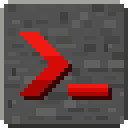
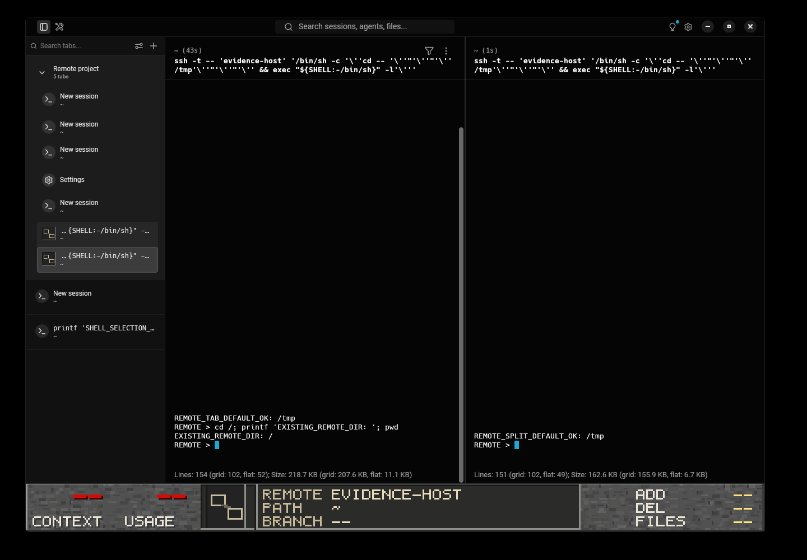
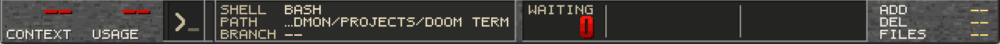
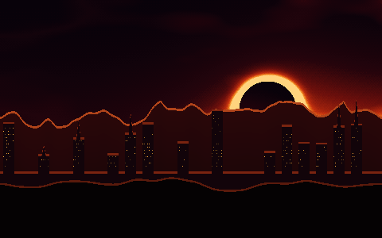
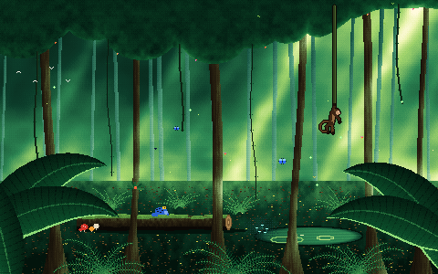

<p align="center">
  
</p>

# Doom Term

**A terminal with a cockpit. Keep your shells, projects, and coding agents in view.**

Doom Term pairs Warp's Rust terminal engine with a Doom-inspired status plate, optional animated
backgrounds, and a local-first desktop experience. Run your own tools, see what they are doing,
and move between projects without losing your place. No Warp account is required.

[Download](https://github.com/CMLeadmon/Doom-Term/releases/latest) · [Documentation](docs/doom-term/README.md) · [Roadmap](docs/doom-term/roadmap.md) · [Release notes](RELEASE_NOTES.md) · [Contribute](CONTRIBUTING.md)

[](https://github.com/CMLeadmon/Doom-Term/actions/workflows/doomterm-ci.yml) [](https://github.com/CMLeadmon/Doom-Term/releases/latest) [](LICENSES.md)



*Actual Linux application capture from the tab-group implementation now on `main`.
These group-directory features are newer than v1.1.7. [See the evidence](evidence/tab-groups/report.html).*

## Your terminal, with more context

- **Know what is running.** The docked plate shows the active shell or supported coding agent,
  working directory, branch, and repository changes. Supported status integrations add context,
  usage, and waiting signals when that data is available.
- **Keep your workflow.** GPU rendering, command blocks, searchable history, split panes,
  horizontal or vertical tabs, and shell selection build on Warp's terminal core.
- **Make it yours.** Install optional Redsky, Blue Highway, Canopy, Replay, or BFR theme packs.
  Background animation and plate color are configured by the theme.
- **Keep the desktop local.** Doom Term's build excludes Warp's hosted AI, account, cloud-sync,
  telemetry, and crash-upload implementations. Your shell commands, SSH connections, and
  separately installed agents still use their own networks and services.
- **Organize by project.** On `main`, groups survive becoming empty and can give new tabs and
  splits a local or SSH directory. Existing sessions continue when you change the default.



*Native status plate capture. Fields vary with the active pane and available integration data.*

<table>
  <tr>
    <td></td>
    <td></td>
  </tr>
  <tr>
    <td>Redsky: a storm behind your terminal.</td>
    <td>Canopy: a quieter backdrop.</td>
  </tr>
</table>

*Theme artwork previews; the terminal composites them behind text at the configured opacity.
[Installation and theme details](docs/doom-term/README.md#themes).*

## Get Doom Term

Download the installer or archive for your platform from
[the latest release](https://github.com/CMLeadmon/Doom-Term/releases/latest).
Check downloads against the `SHA256SUMS.txt` attached to that same release.

| Platform | Download |
| --- | --- |
| Linux x86_64 | `doomterm-linux-x86_64.tar.gz` |
| macOS Apple silicon | `doomterm-macos-arm64.dmg` or `doomterm-macos-arm64.zip` |
| Windows x86_64 | `DoomTermSetup.exe` or `doomterm-windows-x64.zip` |

The latest published release is **v1.1.7**. The `main` branch also contains persistent tab groups
and local/SSH group defaults. Theme work is still in progress; the next release is on hold until
that work is complete. [Platform requirements and installation](docs/doom-term/getting-started.md).

## Build from source

Use the pinned Rust toolchain and the platform dependencies described in the
[development guide](docs/doom-term/development.md).

```sh
git clone https://github.com/CMLeadmon/Doom-Term.git
cd Doom-Term
cargo run -p warp --bin doomterm --no-default-features --features doomterm,gui
```

For an installed binary, include `release_bundle` so subsequent launches use the existing instance:

```sh
cargo build --release -p warp --bin doomterm --no-default-features --features release_bundle,doomterm,gui
```

On Linux, the repository provides an Ubuntu 24.04 build container through
[`script/doomterm/build-env`](script/doomterm/build-env).

## Built in the open

Bugs, focused improvements, documentation, and agent-assisted contributions are welcome.
Start with [CONTRIBUTING.md](CONTRIBUTING.md); coding assistants should also read
[AGENTS.md](AGENTS.md) and [AI_POLICY.md](AI_POLICY.md).

[Report a bug](https://github.com/CMLeadmon/Doom-Term/issues/new?template=01_bug_report.yml) ·
[Request a feature](https://github.com/CMLeadmon/Doom-Term/issues/new?template=02_feature_request.yml) ·
[Get help](SUPPORT.md) · [Report a vulnerability privately](SECURITY.md)

Product claims are backed by the [evidence dossier](evidence.html). Historical design studies
live in [`mockups/`](mockups/README.md); they are separate from the shipping application.

## License and credits

Doom Term is an independent fork of [Warp](https://github.com/warpdotdev/warp).
The application is **AGPL-3.0-only**; `warpui` and `warpui_core` are **MIT**.
See [LICENSE](LICENSE), [LICENSES.md](LICENSES.md), and [NOTICE.md](NOTICE.md) for scope and credits.
Existing copyright notices and third-party licenses remain in place.

Doom Term is not affiliated with or endorsed by Warp, id Software, or ZeniMax Media.
Optional Doom gameplay recordings retain their third-party rights; the application license does
not grant rights to the game's assets. [Asset attribution](NOTICE.md#optional-theme-media).
