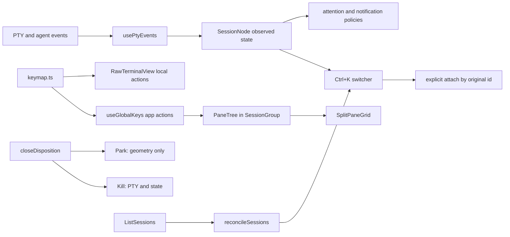

# Reformation Agent Review Guide

This is the review entry point for branch `reformation`, based on `main` at
`9ba5c7e`. The branch implements ten base-UX improvements without adding a
runtime dependency, permanent terminal chrome, or automatic command execution.

## Review contract

- The terminal remains pass-through. Plain Ctrl-letter input belongs to the
  foreground process; application actions use Ctrl+Shift, Ctrl+K, or Ctrl+1–9.
- The status plate remains the only persistent chrome. Every new chooser or
  destructive-action gate is transient.
- Missing telemetry is unknown, never success or idle. This is especially
  important for notifications and close policy.
- Recovery may attach to a session the daemon proves is live. It never executes
  the command string returned by discovery.
- Existing `DOOM_TERM_WORKSPACES_V2` data migrates in place. New schema fields
  are optional at the type boundary.

## System map



## Feature-by-feature reviewer map

| # | User-visible behavior | Production entry points | Pure/component proof | Manual probe |
|---|---|---|---|---|
| 1 | Plate waiting rows select their session; Ctrl+Shift+A cycles attention; acknowledged quiet rows return only after output | `attentionQueue.ts`, `waitingList.ts`, `hud/canvas.ts`, `StatusPlate.tsx` | `attentionQueue.test.ts`, `waitingList.test.ts`, `canvas.test.ts` | Click a waiting row, then produce new background output |
| 2 | Background asks, failures, and successful commands over 10 s produce routed native notifications | `sessionNotifications.ts`, `useSessionNotifications.ts`, `usePtyEvents.ts` | `sessionNotifications.test.ts`, background routing in `ptyClient.test.ts` | Enable from Ctrl+K, run a long command in another session, click notification |
| 3 | Ctrl+K is an attention-first/MRU session switcher with deep search and tail preview | `sessionSwitcher.ts`, `paletteActions.ts`, `CommandPalette.tsx` | `sessionSwitcher.test.ts`, `CommandPalette.test.tsx` | Search by branch, cwd, agent, or output that is absent from the visible row |
| 4 | Ctrl+Shift+C/V implements terminal clipboard semantics; modifier triple-click selects a trusted turn region | `terminalSelection.ts`, `RawTerminalView.tsx`, `keymap.ts` | `terminalSelection.test.ts`, `RawTerminalView.test.tsx`, `keymap.test.ts` | Verify plain Ctrl+C still interrupts; paste two lines without executing the first separately |
| 5 | Previous/next turn navigation wraps; current turn can be copied | `turnMarks.ts`, `RawTerminalView.tsx` | `turnMarks.test.ts` | Use Ctrl+Shift+[ / ] / Y in a known agent session |
| 6 | A transient quick selector extracts URL, file-line, path, SHA, and issue references from the newest 200 rendered lines | `quickSelect.ts`, `QuickSelectOverlay.tsx`, `RawTerminalView.tsx` | `quickSelect.test.ts`, `QuickSelectOverlay.test.tsx` | Ctrl+Shift+E, choose a label, Enter to copy or Shift+Enter to insert |
| 7 | Binary split geometry persists, resizes, collapses on close, and equalizes; split right/down are in Ctrl+K | `paneTree.ts`, `SplitPaneGrid.tsx`, `sessionStore.ts`, `useWorkspaceSet.ts` | `paneTree.test.ts`, `SplitPaneGrid.test.tsx`, `sessionStore.test.ts` | Split twice, drag both divider orientations, reload, equalize |
| 8 | Spatial focus follows pane geometry; transient pane labels select directly; zoom preserves mounted siblings | `paneTree.ts`, `PaneSelectOverlay.tsx`, `SplitPaneGrid.tsx`, `useGlobalKeys.ts` | geometry and zoom cases in `paneTree.test.ts` and `SplitPaneGrid.test.tsx` | Ctrl+Shift+arrows, Space, and Z across an asymmetric tree |
| 9 | Closing an observed idle shell kills immediately; live/unknown work gets PARK versus KILL with PARK selected | `sessionClose.ts`, `CloseSessionPrompt.tsx`, `useWorkspaceSet.ts`, `App.tsx` | `sessionClose.test.ts`, `CloseSessionPrompt.test.tsx` | Close a running command, park it, find `PARKED` in Ctrl+K, restore it |
| 10 | Daemon-only sessions appear as explicit recovery choices and attach by original id | `tmux.rs`, `backend/main.rs`, `ptyClient.ts`, `sessionRecovery.ts`, `useWorkspaceSet.ts` | tmux recovery tests, `sessionRecovery.test.ts`, recovery protocol case in `ptyClient.test.ts` | Leave a durable session, restart daemon/UI, select its `RECOVERY` row |

## Keyboard ownership

Application/global bindings:

| Binding | Action |
|---|---|
| Ctrl+K, Ctrl+Shift+K, Ctrl+Shift+P | Session switcher and commands |
| Ctrl+1–9 | Select or restore stable session number |
| Ctrl+Shift+A | Next session needing attention |
| Ctrl+Shift+arrows | Spatial pane focus |
| Ctrl+Shift+Space | Temporary direct pane labels |
| Ctrl+Shift+Z | Toggle focused-pane zoom |
| Ctrl+Shift+T / W / O / M | New session / close / open folder / mute |

View-local bindings:

| Binding | Action |
|---|---|
| Ctrl+Shift+C / V | Copy selection / safe clipboard paste |
| Ctrl+modifier triple-click | Select trusted command/turn region |
| Ctrl+Shift+[ / ] / Y | Previous turn / next turn / copy turn |
| Ctrl+Shift+E | Developer quick select |
| Ctrl+F / End | Search this session / return to tail |

`BINDINGS` and `VIEW_BINDINGS` in `src/core/keymap.ts` are the authoritative
tables. The first-run overlay renders from them; `RawTerminalView` and
`useGlobalKeys` match against the same data, preventing documented and actual
bindings from drifting.

## Persistent schema changes

`SessionNode` gained optional observed/UI fields:

- command timing and dedupe: `executionSerial`, `lastExecutionDurationMs`,
  `lastExecutionStartedAt`, `lastExitCode`;
- attention/focus: `attentionSerial`, `lastUsedAt`, `blockedOnUser`;
- process boundary: `atPrompt`;
- lifecycle: `parked`.

`SessionGroup` gained:

- `paneTree?: PaneTree`, a binary `leaf | split` union with direction and ratio;
- `zoomedSessionId?: string`, a presentation flag that does not change geometry.

`backfillPaneTrees` converts legacy `single`, `split-h`, `split-v`, and
`grid-2x2` groups at load. For legacy single layout, the active session becomes
the visible leaf and other sessions remain mounted but hidden.

## Event and notification flow

PTY callbacks now carry `sessionId` for output, prompt, command, execution, TUI,
and agent state events. Global handlers receive background sessions as well as
the active session. `usePtyEvents` writes only the narrow fields needed by
policies; it does not recreate command blocks.

Notification transitions are pure and deduplicated by the source serial:

- `PermissionRequest`: false → true while backgrounded;
- command result: new execution serial and non-zero exit;
- successful command: new serial and measured duration at least 10 seconds;
- active session plus focused document: suppressed.

Notification permission is requested only from the explicit Ctrl+K action.

## Park, kill, and recovery safety

PARK removes a session id from its group and pane tree, leaves the PTY and
emulator alive, and marks the node `parked`. Selecting its Ctrl+K row restores
it and focuses its original PTY. KILL sends the daemon action, disposes frontend
runtime state, removes the node, and collapses its tree parent.

Recovery protocol:

```text
Client: ListSessions { request_id }
Server: SessionListing { request_id, sessions: [{ id, cwd, command, durable }] }
```

The daemon merges two witnesses:

1. its in-memory `PtySession` map, including non-durable direct PTYs;
2. `tmux -L doom-term list-panes -a`, filtered to names beginning `doom-`.

The frontend polls no faster than every six seconds, reconciles by id, and puts
only daemon-only ids into `RECOVERY` palette rows. Activating a row calls the
existing attach-or-create path with that id. The reported `command` is display
and search data only; it is never submitted to the shell.

## Known limits and deliberate constraints

- Turn marks are conservative known-agent prompt patterns (`> ` for Claude,
  Codex, and Antigravity). `AnsiLine` does not yet retain OSC-133 line markers,
  so unknown agents and bare shells get no invented semantic boundary.
- Quick select scans the newest 200 rendered lines, not the entire tmux history.
- Native notifications depend on browser/desktop permission and do nothing
  after denial.
- PARK for a non-durable session survives only while the current daemon runs;
  the close prompt states this explicitly.
- Recovery finds tmux only through the same sidecar/PATH/Homebrew resolution as
  session creation and never inspects the user's default tmux socket.
- Tauri compilation requires host GTK/WebKit development packages on Linux.
  Record an unavailable package as an environment limit, not a code failure.

## Suggested review order

1. Review pure policy modules and their tests: attention, notifications,
   switcher, selection, quick select, pane tree, close, recovery.
2. Review `keymap.ts` ownership before component key handlers.
3. Review `usePtyEvents.ts` and `ptyClient.ts` for exact session routing.
4. Review `useWorkspaceSet.ts` transitions for create/split/park/restore/kill.
5. Review Rust private-socket enumeration and protocol variants.
6. Run the verification commands below, then perform the manual probes in the
   feature table.

## Verification commands

```bash
npm test
npm run build
npm run hud:check
cargo test --manifest-path crates/doom-term-pty/Cargo.toml
cargo test --manifest-path backend/Cargo.toml
cargo test --manifest-path src-tauri/Cargo.toml
git diff --check main...reformation
```

Rendered QA should exercise app load and Ctrl+K. If the Browser plugin and
Playwright are unavailable, record that limitation and retain component-level
interaction evidence rather than adding an unreviewed browser dependency.

## Verification evidence for this branch

| Gate | Result |
|---|---|
| `npm test` | PASS — 49 Node tests and 294 Vitest tests |
| `npm run build` | PASS — TypeScript and Vite production bundle |
| `npm run hud:check` | PASS — 0 of 15,360 pixels differ |
| PTY crate | PASS — 54 tests |
| Backend crate | PASS — 57 tests; 3 live-account probes intentionally ignored |
| Rendered smoke | PASS — Chrome 152 at 1440×900; URL/title/nonblank/overlay/console checks and Ctrl+K interaction |
| Tauri crate | ENVIRONMENT BLOCK — Linux host lacks `glib-2.0.pc`/`gobject-2.0.pc`/`gio-2.0.pc` |
| Rust formatting | ENVIRONMENT BLOCK — the selected Rust toolchain has no `rustfmt` component |

The Browser plugin was absent and Playwright was not installed. QA used the
available Chrome DevTools Protocol without adding a dependency. Desktop was
tested; mobile is deliberately outside this terminal manager's target surface.
