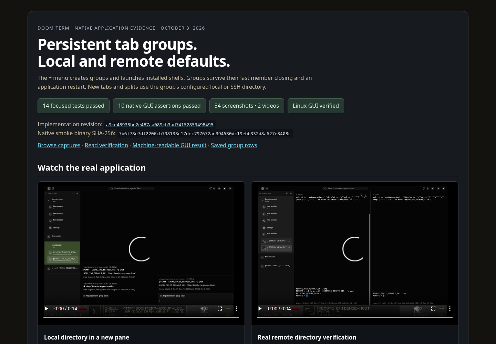
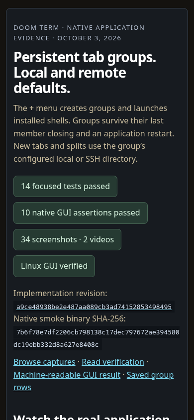

# Evidence page QA

Summary: the tab group evidence section renders and its interactions pass at desktop
1440×1000 and mobile 390×844 in Chromium. Browser plugin not available; existing Python
Playwright and Chrome were used without adding dependencies.

Environment: `http://localhost:8085/evidence.html` and
`http://localhost:8085/evidence/tab-groups/report.html`.

| Check | Result |
| --- | --- |
| Page URL/title and meaningful content | PASS |
| No framework overlay | PASS |
| Console and page error checks | PASS — no errors |
| All 34 gallery images load | PASS |
| Both videos load and play | PASS — 14.833s and 4.833s |
| SSH filter selects 3 captures | PASS |
| Local filter selects 9 captures | PASS |
| Expanded screenshot opens and closes | PASS |
| Mobile feature section fits viewport | PASS |

Interaction: load each report, force image loading, play/pause both videos, choose Remote
SSH, verify its pressed state and visible count, expand a capture, close it, and restore
All captures. On mobile, choose Local directories, expand the image, and close with Escape.

Commands: an external temporary Python Playwright script used `chromium.launch`,
`page.goto`, scoped locators, state assertions, and `page.screenshot`. The machine-readable
result is in `result.json`; screenshots are `desktop.png` and `mobile.png`.

Limits: the evidence page is tested in Chromium; Firefox and WebKit were not exercised.
This checks report presentation. Native terminal feature verification is documented in
its own report and smoke JSON. The Browser plugin can provide in-app inspection for future
frontend work.

