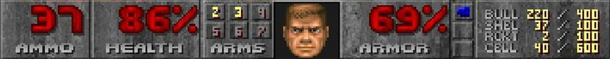
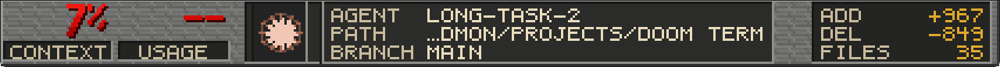

# v1.1.1 status plate comparison

| Doom 1993 HUD | Doom Term v1.1.0 | Doom Term v1.1.1 live capture |
| --- | --- | --- |
|  |  |  |

The Doom crop comes from a [screenshot of the 1993 PC original](https://www.gamestar.de/galerien/doom%2C132803.html). Both Doom Term crops are from live application captures: [v1.1.0](../../remediation/shots/v110-06-composited-frame.png) and the v1.1.1 debug build. The [deterministic v1.1.1 plate render](doomterm-v111-plate-preview.png) additionally shows the queue and diff presentation with example data.

The original bar has irregular grey material, text placed directly on that material, and a compact ammo table with pale labels and yellow values. The previous Doom Term plate repeated horizontal brick-like marks, recessed Context/Usage labels in dark strips, and placed the diff table in a dark block. The updated render uses an irregular grey chassis, removes those strips and block, and reserves queue width for tab names.

[id Software's `st_stuff.c`](https://github.com/id-Software/DOOM/blob/master/linuxdoom-1.10/st_stuff.c) draws the `STBAR` graphic patch into the status bar background, then positions counters over it. [The widget renderer in `st_lib.c`](https://github.com/id-Software/DOOM/blob/master/linuxdoom-1.10/st_lib.c) draws numeric patches and restores their background when values change. Doom Term generates its own material and glyphs; it does not bundle Doom WAD art.
